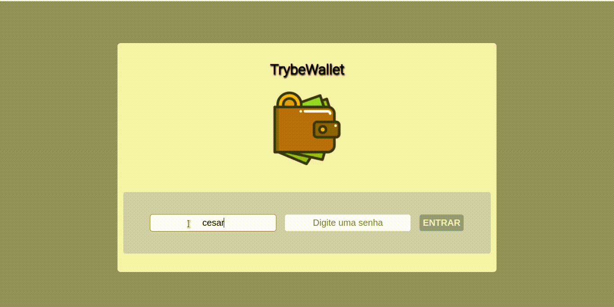

# Bem vindo ao repositório do projeto TrybeWallet!

Este projeto foi desenvolvido individualmente com o intuito de colocar em prática o conteúdo de React Redux estudado no bloco de Front End da Trybe 🚀

O app de wallet adiciona despesas pessoais em formato de diversas moedas mundiais e realiza a conversão em tempo real baseado na API [API_de_Cotações](https://economia.awesomeapi.com.br/json/all) e pode ser utilizado no link: [App_de_despesas](https://cesarramoss.github.io/TrybeWallet/)

---

# Habilidades

Nesse projeto foi usado:

  - Store Redux em React
  - _Reducers_ no Redux
  - _Actions_ no Redux
  - _Dispatchers_ no Redux
  - _Actions assíncronas_ em componentes de Classe  
  - Eslint para estrutura do código
  - Html5, Css3
  
---
